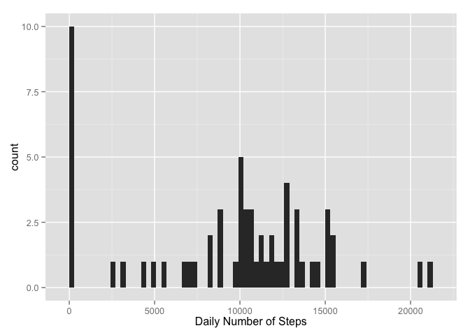
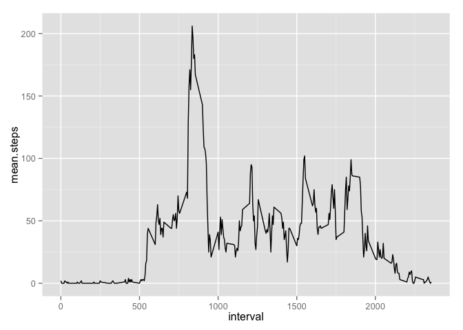
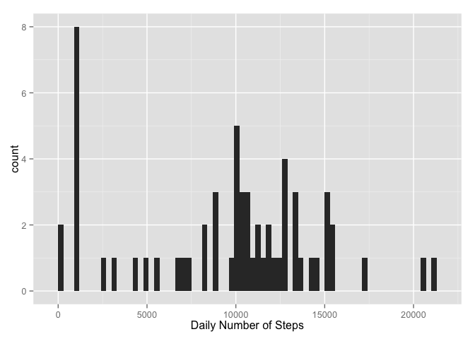
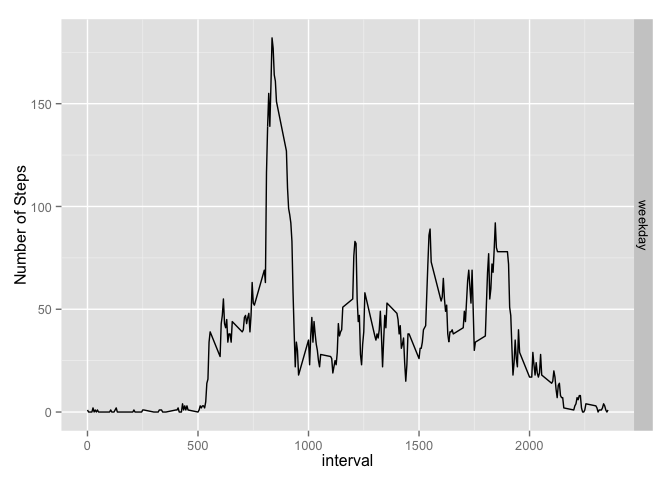

# Reproducible Research: Peer Assessment 1


## Loading and preprocessing the data

```r
library(plyr)
library(ggplot2)


activity <- read.csv("activity.csv") # read in the data
activity$date <- as.POSIXct(activity$date) # set the dates to POSIXct
```

## What is mean total number of steps taken per day?
Calculate the total number of steps taken per day
Make a histogram of the total number of steps taken each day
Calculate and report the mean and median of the total number of steps taken per day

```r
#Calculate the total number of steps taken per day
dailysteps <- aggregate(activity$steps, by = list(activity$date), sum, na.rm=TRUE) 
names(dailysteps) <- c("Date", "steps")

#Make a histogram of the total number of steps taken each day
qplot(steps, data = dailysteps, geom="histogram", xlab = "Daily Number of Steps", binwidth = 300)
```

 


## What is the average daily activity pattern?
Make a time series plot of the 5-minute interval (x-axis) and the average number of steps taken, averaged across all days (y-axis)


```r
#df of the mean and median number of steps taken, averaged across all days (y-axis)
intsteps <- aggregate(activity$steps, by = list(activity$interval), mean, na.rm=TRUE)
intstepsmed <- aggregate(activity$steps, by = list(activity$interval), median, na.rm=TRUE)

intsteps <- cbind(intsteps[], intstepsmed$x)

#Tidy the df names and round the numbers
names(intsteps) = c("interval","mean.steps", "median.steps")
intsteps$mean.steps <- round(intsteps$mean.steps)
intsteps$median.steps <- round(intsteps$median.steps)


ggplot(intsteps, aes(x = interval, y = mean.steps)) + geom_line()
```

 


## Imputing missing values
There are a number of days/intervals where there are missing values (coded as NA). The presence of missing days may introduce bias into some calculations or summaries of the data.

Calculate and report the total number of missing values in the dataset (i.e. the total number of rows with NAs).  Replace the missing values with the median value for that interval.

Create a new dataset that is equal to the original dataset but with the missing data filled in.

Make a histogram of the total number of steps taken each day and Calculate and report the mean and median total number of steps taken per day.

```r
#find the NAs
na.steps <- subset(activity, is.na(steps))
num.NAs <-length(na.steps$steps)


#replace the NAs with the median number of steps for that period
nstps <- data.frame(date=activity$date[is.na(activity$steps)], interval = activity$interval[is.na(activity$steps)], steps=intsteps[match(intsteps$interval, activity$interval[is.na(activity$steps)]),3])

# remove the NA's from the period
activity <- subset(activity, !is.na(steps))

# Append the median steps to the Activity DF
activity <- rbind(activity, nstps)

#sum the number of steps each day into the dailysteps2 DF and get the mean and median 
dailysteps2 <- aggregate(activity$steps, by = list(activity$date), sum, na.rm=TRUE)
names(dailysteps2) <- c("Date", "steps")

qplot(steps, data = dailysteps2, geom="histogram", xlab = "Daily Number of Steps", binwidth = 300)
```

 


```r
mean.steps2 <- mean(dailysteps2$steps) # 
median.steps2 <- median(dailysteps2$steps)
```


## Are there differences in activity patterns between weekdays and weekends?
Create a new factor variable in the dataset with two levels – “weekday” and “weekend” indicating whether a given date is a weekday or weekend day.

Make a panel plot containing a time series plot (i.e. type = “l”) of the 5-minute interval (x-axis) and the average number of steps taken, averaged across all weekday days or weekend days (y-axis).


```r
# Add the Weekday/weekend identifier

activity$week <- ifelse(weekdays(activity$date) == "Saturday" | weekdays(activity$date) == "Sunday" ,"weekend","weekday")

#df of the mean and median number of steps taken, averaged across all days (y-axis)
intsteps2 <- aggregate(activity$steps, by = list(activity$week, activity$interval), mean, na.rm=TRUE,data = activity)
intstepsmed2 <- aggregate(activity$steps, by = list(activity$week, activity$interval), median, na.rm=TRUE)

intsteps2 <- cbind(intsteps2[], intstepsmed2$x)

#Tidy the df names and round the numbers
names(intsteps2) = c("weekday", "interval","mean.steps", "median.steps")
intsteps2$mean.steps <- round(intsteps2$mean.steps)
intsteps2$median.steps <- round(intsteps2$median.steps)


ggplot(intsteps2, aes(x = interval, y = mean.steps)) + ylab("Number of Steps") + geom_line() + facet_grid(weekday~.)
```

 
